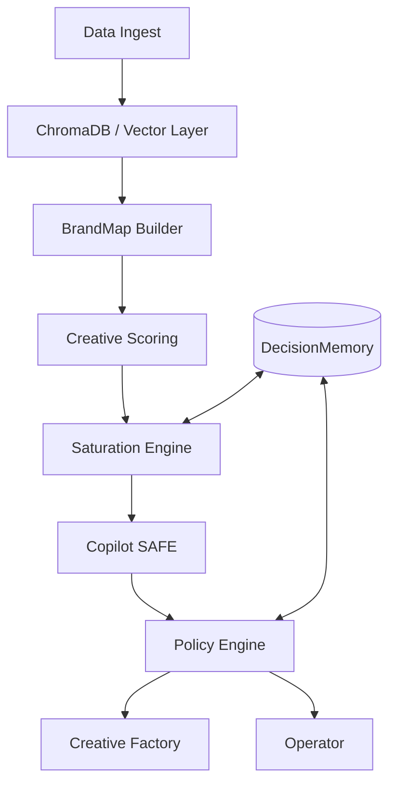

# PLAN FINAL COMPLETO: Meta Ops Agent (Architect Correction Pass)

## 1 Arquitectura
Diseño modular basado en micro-módulos asíncronos con validación de contrato por esquema.

## 2 Data Layer (Vector Storage)
**MVP (ChromaDB)**: 
- Persistencia: `volumes/chroma_data` montado en Docker.
- Backups: Snapshots diarios vía `.tar.gz` del directorio persistente.
- Restauración: Pipeline de reinyección de backups ante corrupción de índice.

**Escalado (Migration Path)**:
- Destino: **Pinecone (Serverless)** o **Supabase Vector**.
- Estrategia: Exportación de `id, embedding, metadata` a Parquet/S3 e ingesta asíncrona hacia el nuevo provider.
- Consistencia: Sincronización multi-instancia garantizada por el backend asíncrono.
- Fallback: Si la DB vectorial offline → Retrieval de respaldo basado en caché de vectores críticos en Redis.

## 3 Schemas (BrandMap & Contracts)
**BrandMap Schema (Strict JSON/Pydantic)**:
- `core_identity`: `{mission, values, tone_voice, personality_traits}`
- `offer_layer`: `{main_product, upsells, pricing_psychology, risk_reversal}`
- `audience_model`: `[{avatar_name, demographics, psychographics, pains, desires, triggers}]`
- `differentiation_layer`: `{usp, competitive_moat, proof_points}`
- `narrative_assets`: `{lore, story_hooks, core_myths}`
- `creative_dna`: `{color_palette, typography_intent, visual_constraints}`
- `market_context`: `{seasonal_factors, current_trends}`
- `competitor_map`: `[{name, strategy_type, weak_points}]`
- `opportunity_map`: `[{gap_id, strategy_recommendation}]`
- `metadata`: `{version, hash, created_at, updated_at}`

**Angle Taxonomy System**:
- **L1 (Intent)**: Emotional, Rational, Social Proof, Authority, Scarcity.
- **L2 (Driver)**: Pain-Relief, Status-Gain, Fear-Optimization, Ego-Validation, Efficiency.
- **L3 (Execution)**: Listicle, VS, UGC-Testimony, Side-by-Side, Narrative-Story.
- **Tagging**: Clasificación por similitud de coseno contra centroides de tags definidos (30+ tags base).
- **Confidence**: Score 0.0-1.0; fallback manual si Confidence < 0.7.

## 4 Guardrails (Executable Policy Engine)
Motor de reglas con prioridad descendente y validación pre-commit.

1. **Entity Lock System**: Bloquea cualquier entidad (AdSet/Ad) con `is_locked=True` en la DB local (ej: cambios manuales recientes).
2. **Learning Phase Protection**: Bloquea cambios si la entidad está en `LEARNING` y tiene < 3 días de actividad.
3. **Daily Spend Cap**: Enforcement total; si el gasto acumulado del día > `UserCap`, se rechaza toda acción de creación/escalado.
4. **Budget Delta Validation**: `abs(SuggestedBudget - CurrentBudget) / CurrentBudget <= 0.20`.
5. **Cooldown Enforcement**: Mínimo 24h entre cambios del mismo tipo en la misma entidad.
6. **Dry Run Layer**: Toda acción debe retornar un `ActionImpactReport` antes de ejecutarse realmente.

## 5 Saturation Math (Mathematical Specification)
Variables normalizadas $x_{norm} = \text{clamp}(\frac{x - min}{max - min}, 0, 1)$.

- $V_1$: **AngleDensity**: Densidad de anuncios similares activos en la cuenta (0-1).
- $V_2$: **SimilarityIndex**: Similitud de coseno máxima contra el top 10% histórico (0-1).
- $V_3$: **CTRDecayRate**: $1 - (\frac{CTR_{3d}}{CTR_{14d}})$, clamp a 0-1.
- $V_4$: **FrequencyAcceleration**: $\frac{Frequency_{7d}}{Frequency_{Prev7d}} - 1$, normalizado.
- $V_5$: **CPMInflation**: $\frac{CPM_{7d}}{CPM_{Prev7d}} - 1$, normalizado.

**Fórmula Final**:
$SaturationScore = 100 \times (0.25V_1 + 0.25V_2 + 0.20V_3 + 0.15V_4 + 0.15V_5)$

## 6 Modules
- **M1: Data Ingest**: Carga de docs/web. Output: Markdown limpio + Metadata original.
- **M2: BrandMap Builder**: Procesamiento LLM + Embeddings. Output: BrandMap JSON v2.0.
- **M3: Creative Scoring**: Input: Image/Script + BrandMap. Output: Scoring Vector.
- **M4: Saturation Engine**: Input: Meta Stats (Pandas). Output: SaturationReport 0-100.
- **M5: Copilot SAFE**: Dashboard React + Websockets para alertas en tiempo real.
- **M6: Creative Factory**: Generación de assets de reemplazo basados en `OpportunityMap`.
- **M7: Operator**: Cliente Meta API con `PolicyEngine` inyectado.

## 7 Checkpoints
| Checkpoint | DoD Medible | Dataset / Output | Validación Automática |
| :--- | :--- | :--- | :--- |
| **0: Vector Layer** | ChromaDB persiste tras reinicio de container. | Snapshot `chroma_data`. | Unit Test de persistencia. |
| **1: BrandMap v2** | Objeto JSON cumple schema completo (strict). | BrandMap JSON. | Validacion Pydantic. |
| **2: Angle Tagging** | Accuracy > 90% en dataset de 50 anuncios conocidos. | Tagged Ads CSV. | Matriz de confusión vs GroundTruth. |
| **3: Scoring Engine** | Correlación > 0.6 entre Score y CTR histórico. | Performance Prediction JSON. | Regresión estadística. |
| **4: Saturation Logic** | SaturationScore reportado para 10 adsets reales. | SaturationReport. | Delta Check vs Meta API. |
| **5: Policy Engine** | Bloqueo exitoso de 100% de violaciones inyectadas. | `ViolationLog` detallado. | Fuzzing de reglas. |
| **6: Factory Beta** | 5 guiones generados alineados 100% a DNA Visual. | Script Assets. | LLM-as-a-judge (Brand Alignment). |
| **7: Operator Alpha** | Ejecución exitosa de 1 acción real via API (Sandbox). | Meta API 200 OK. | Log Audit Trace. |

## 8 Stack
- **Backend**: Python 3.11 (FastAPI).
- **Vector Layer**: ChromaDB (MVP) → Pinecone (Production).
- **IA**: GPT-4o-0806 (Structured Output) + text-embedding-3-small.
- **Data**: Pandas (Analytics) + Pydantic v2 (Schemas).
- **Queue**: Celery + Redis.
- **Logs**: Structured JSON logs + Sentry.

## 9 Riesgos
- **API Change**: Meta modifica el payload de `insights`. **Mitigación**: Capa de abstracción de datos (Adapter Pattern).
- **Vector Collision**: Similitud falsa por ruido en el chunking. **Mitigación**: RecursiveCharacterTextSplitter con validación de tokens.
- **Policy Overlap**: Reglas que se anulan entre sí. **Mitigación**: Priorización estricta por índice de regla.

## 10 Checklist Final
- [ ] ¿El BrandMap tiene versión y hash de consistencia?
- [ ] ¿El SaturationScore está normalizado 0-100 sin overflows?
- [ ] ¿Toda acción del Operador tiene un `ReasoningID` rastreable en DecisionMemory?
- [ ] ¿Existe el switch manual para desactivar el Operator en < 1s?
- [ ] ¿El PolicyEngine lanza excepción ANTES de llamar a la Meta SDK?
